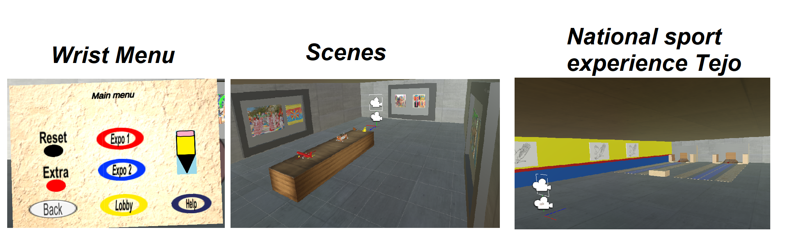

# Museum-VR

This project contains information related to the creation of a museum-oriented virtual environment. Around this, the museum contains information specific to Colombian culture.

Compatible devices: oculus quest 1 and 2

Plataform: Unity

# Mechanics:

* Writable scenes to leave your message.
* Touch to expand the information of each art exhibition.
* Wrist menu to move between scenes, get help information and invoke the pencil object to interact with writable objects.
* Canvas to describe each work Object.
* Tejo simulator.

<h3 align="center">
  
</h3>

# Links:

* Unity files : https://drive.google.com/file/d/1kPMjXJS--bNrIZ3qnXuL-sBR007YlvZG/view?usp=sharing
* Apk : https://drive.google.com/file/d/1PKT2d5JGSuTFSa1kZq0UxPHpi5XGwFDg/view?usp=sharing
* Demo video : https://drive.google.com/file/d/1k8w3vwe2Q1d4vkvH2WGppCLpNtGKNey5/view?usp=sharing

# Important information

This project was run on oculus quest, using unity version 2020.3.20f1. The 3d objects used were freely accessible and/or created by the author of this repository. The images and sounds used were obtained through the real exploration of the urban environment of Bogota. Some scenes were inspired by real museums present in Bogota.

This project was run for educational purposes only, exploring virtual reality using the unity platform.

